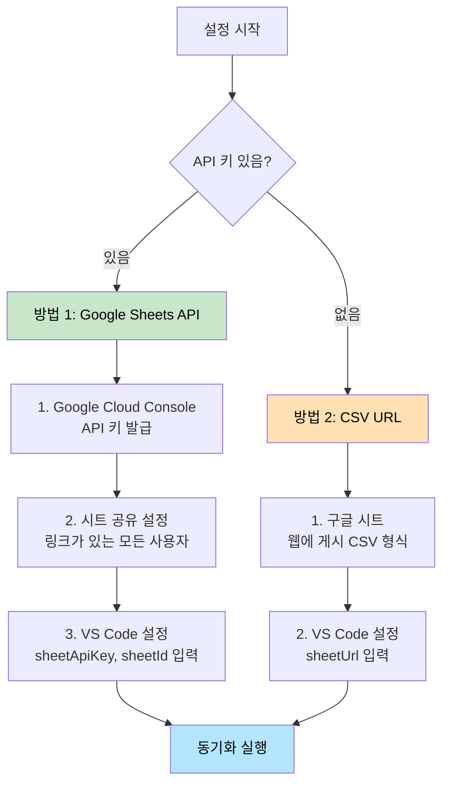
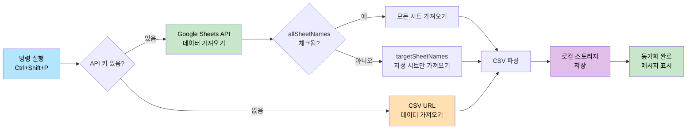
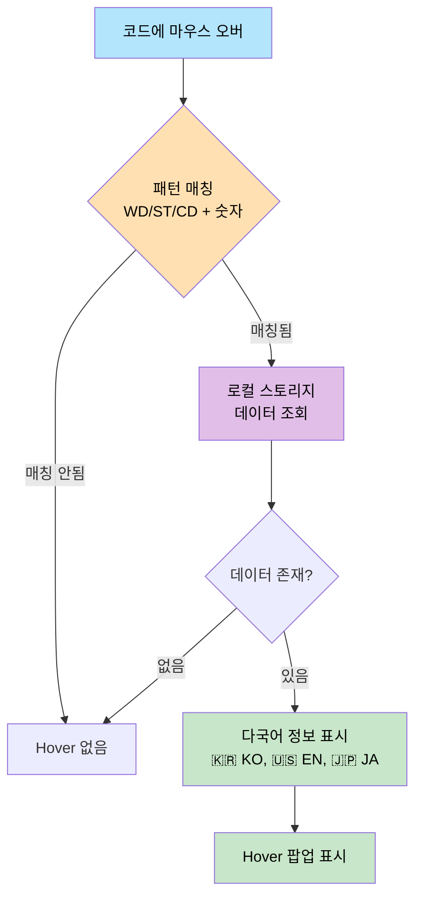
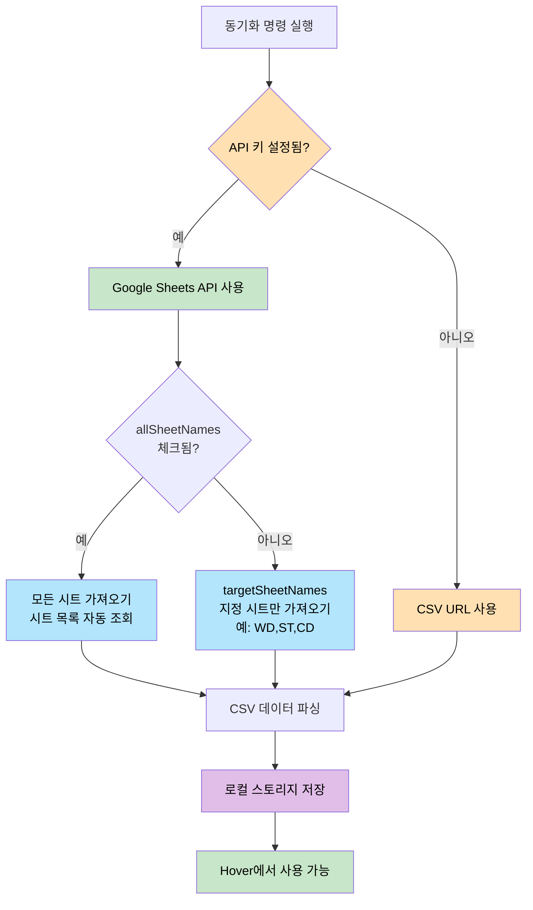
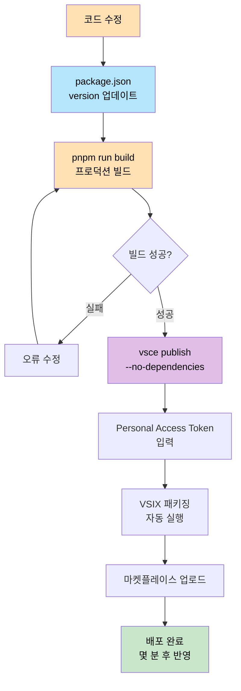

# Sheet Language Global Helper

구글 스프레드시트에서 다국어 데이터를 가져와 코드에서 hover로 확인할 수 있는 VS Code 익스텐션입니다.

## 🔗 링크

- 📦 [VS Code 마켓플레이스](https://marketplace.visualstudio.com/items?itemName=language-global-helper.lang-global-helper)
- 💻 [GitHub 저장소](https://github.com/jinyDuo/colo-language-extension)

## ✨ 주요 기능

- 📊 **구글 스프레드시트 연동**: Google Sheets API 또는 CSV URL을 통해 다국어 데이터 가져오기
- 🔍 **Hover 기능**: 코드에서 `WD`, `ST`, `CD`로 시작하는 키에 마우스를 올리면 다국어 정보 표시
- 🏷️ **인라인 번역(인레이 힌트)**: 호버 없이 코드 옆에 번역을 바로 표시
- 💾 **로컬 캐싱**: 데이터를 로컬 스토리지에 저장하여 오프라인에서도 사용 가능
- 🔄 **수동 동기화**: 원할 때만 최신 데이터로 업데이트
- 📝 **다중 시트 지원**: 여러 시트(WD, ST, CD 등)를 한 번에 가져오기

### 전체 워크플로우


## 🚀 시작하기

### 설치

1. VS Code에서 `Ctrl + Shift + X` (또는 `Cmd + Shift + X` on Mac)로 익스텐션 마켓플레이스 열기
2. "Sheet Language Global Helper" 검색
3. 설치 클릭

### 설정

VS Code에서 `Ctrl + ,` (또는 `Cmd + ,` on Mac)를 눌러 설정을 열고, 검색창에 "Sheet Language Global Helper"를 입력하세요.

**인라인 번역/힌트 관련 설정(Show Inline Translation, Inline Translation Language, Hover Key Patterns)이 목록에 안 보일 때:**

1. **아래로 스크롤** — 시트/API 설정 아래에 있을 수 있습니다.
2. **검색** — 설정 검색창에 `inline` 또는 `hoverKey`를 입력해 해당 항목으로 이동해 보세요.
3. **수동 추가** — `Cmd + Shift + P` → "Open User Settings (JSON)" 실행 후 아래를 추가하세요.

```json
"languageHelper.showInlineTranslation": true,
"languageHelper.inlineTranslationLanguage": "ko",
"languageHelper.hoverKeyPatterns": "WD,ST,CD"
```

인라인 힌트가 보이려면 VS Code 설정에서 **Editor: Inlay Hints** 가 `on` 인지 확인하세요.

#### 방법 1: Google Sheets API 사용 (권장)

1. **API 키 발급**
   - [Google Cloud Console](https://console.cloud.google.com/) 접속
   - 프로젝트 생성 → API 및 서비스 > 라이브러리 → "Google Sheets API" 활성화
   - API 및 서비스 > 사용자 인증 정보 > API 키 만들기

2. **시트 공유 설정** ⚠️ 필수
   - 구글 스프레드시트 우측 상단 **공유** 버튼 클릭
   - **링크가 있는 모든 사용자** 선택, **뷰어** 권한 설정

3. **VS Code 설정**
   - **Sheet Api Key**: 발급받은 API 키 입력
   - **Sheet Id**: 스프레드시트 URL에서 ID 추출 (또는 전체 URL 입력 시 자동 추출)
   - **All Sheet Names**: 모든 시트 가져오기 (기본값: 체크됨)
   - **Target Sheet Names**: 지정 시트만 가져오기 (예: `WD,ST,CD`)

#### 방법 2: CSV URL 사용

1. 구글 스프레드시트에서 **파일 > 공유 > 웹에 게시** → CSV 형식 선택
2. 생성된 URL을 **Sheet Url**에 입력

> 💡 **우선순위**: API 키가 있으면 API 사용, 없으면 CSV URL 사용

### 설정 방법 비교



## 📖 사용 방법

### 데이터 동기화

1. `Ctrl + Shift + P` → "Sheet Language Global Helper: Sheet Connect Sync" 실행
2. 동기화 완료 메시지 확인

#### 동기화 프로세스



### Hover로 다국어 확인

코드에서 `hoverKeyPatterns` 설정에 지정된 패턴과 매칭되는 키에 마우스를 올리면 다국어 정보가 표시됩니다:

```typescript
const code = "WD000001";  // 마우스 오버 시 다국어 표시
getLang("ST000001");      // 함수 호출 내부도 감지
t("CD000001");            // getLang, t, i18n, translate 등 지원
```

**표시 정보**: 🇰🇷 KO, 🇺🇸 EN, 🇯🇵 JA

#### Hover 예시


*예시: `WD000527`에 마우스를 올리면 다국어 번역이 표시됩니다 (EN: Client, KO: 클라이언트)*

#### Hover 작동 방식



### 인라인 번역(인레이 힌트)로 바로 보기

동기화를 실행한 뒤, 호버 없이도 코드 옆에 번역이 인라인(인레이 힌트)로 표시됩니다:

```typescript
t("WD000001");        // → 안녕하세요 (inlineTranslationLanguage 기준)
t("프로그램 등록");     // → Program Registration (시트 key가 한글 문자열인 경우)
```

#### 인레이 힌트 예시


> 참고: 인레이 힌트는 sync 이후 및 관련 설정 변경 시 자동으로 갱신됩니다.

## ⚙️ 설정 항목

| 설정 | 설명 | 필수 | 기본값 |
|------|------|------|--------|
| `sheetApiKey` | 구글 시트 API 키 | API 사용 시 | - |
| `sheetId` | 스프레드시트 ID | 선택 | - |
| `allSheetNames` | 모든 시트 가져오기 | 선택 | `true` |
| `targetSheetNames` | 대상 시트 목록 (쉼표 구분) | 선택 | `WD,ST,CD` |
| `hoverKeyPatterns` | Hover/힌트에서 감지할 키 패턴 (쉼표 구분). `WD123`, `ST123` 같은 코드를 추출할 때 사용 | 선택 | `WD,ST,CD` |
| `showInlineTranslation` | 인라인 번역(인레이 힌트) 표시 여부 | 선택 | `true` |
| `inlineTranslationLanguage` | 인라인 번역 표시 언어 (드롭다운: `ko`, `en`, `ja` 등) | 선택 | `ko` |
| `sheetUrl` | CSV URL | CSV 사용 시 | - |

### 동작 방식



**요약**:
- **API 키 있음**: Google Sheets API 사용
  - `allSheetNames` 체크 → 모든 시트 가져오기
  - `allSheetNames` 해제 → `targetSheetNames` 지정 시트만 가져오기
- **API 키 없음**: CSV URL 사용 (단일 시트만 지원)

## 📝 스프레드시트 형식

| key | ko | en | ja |
|-----|----|----|----|
| WD000001 | 안녕하세요 | Hello | こんにちは |
| ST000001 | 감사합니다 | Thank you | ありがとう |

- 첫 번째 행은 헤더로 사용
- `key` 컬럼 필수, `ko`, `en`, `ja` 선택사항

## 🐛 문제 해결

### "API 키가 유효하지 않습니다"
- Google Sheets API 활성화 확인
- 시트가 "링크가 있는 모든 사용자"로 공유되어 있는지 확인

### "시트 ID가 잘못되었습니다"
- 스프레드시트 URL에서 ID를 올바르게 추출했는지 확인

### Hover가 작동하지 않음
- 데이터 동기화를 먼저 실행했는지 확인
- 코드에서 `WD`, `ST`, `CD`로 시작하는 키를 사용했는지 확인

## 🛠️ 개발

### 필수 요구사항

- **Node.js 20.x 이상** (필수)
- pnpm (또는 npm)

### 설치 및 빌드

```bash
# 의존성 설치
pnpm install

# 개발 모드 (watch)
pnpm run watch

# 프로덕션 빌드
pnpm run build
```

### 테스트

1. `F5` 키로 Extension Development Host 실행
2. 새 창에서 테스트 파일 생성
3. `WD000001` 같은 코드에 마우스 오버하여 확인

## 📦 배포

### 사전 준비

1. [Azure DevOps](https://dev.azure.com/)에서 계정/조직 생성
2. Personal Access Token 생성 (Marketplace > Manage 권한 필요)

### 배포 프로세스



### 배포 명령어

```bash
# 1. vsce 설치
pnpm add -g @vscode/vsce

# 2. 빌드
pnpm run build

# 3. VSIX 패키징
pnpm run package:vsix

# 4. 배포 (의존성 체크 건너뛰기)
vsce publish --no-dependencies -p <YOUR_PERSONAL_ACCESS_TOKEN>
```

### 업데이트 배포

⚠️ **중요**: 코드 수정 후 재배포 시 반드시 `package.json`의 `version`을 올려야 합니다.

```bash
# 1. package.json에서 version 업데이트 (예: 0.0.1 → 0.0.2)
# 2. 빌드 및 배포
pnpm run build
vsce publish --no-dependencies -p <TOKEN>
```

### 아이콘 적용

1. 루트 폴더에 `icon.png` 추가 (128x128 권장)
2. `package.json`에 `"icon": "icon.png"` 추가
3. 버전 업데이트 후 재배포

## 📄 라이선스

MIT

## 🤝 기여

이슈 및 풀 리퀘스트를 환영합니다!

---

**Made with ❤️ for better multilingual development experience**
