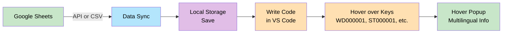
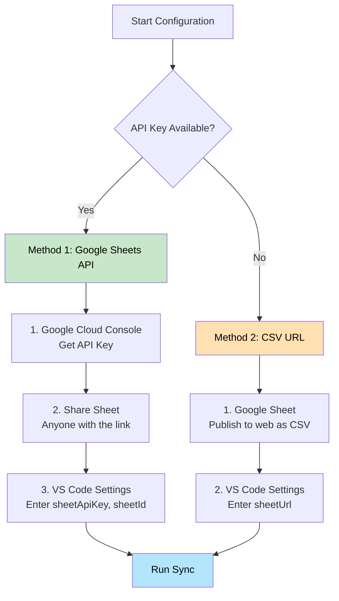
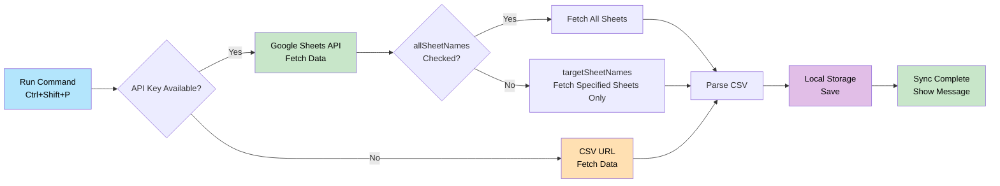
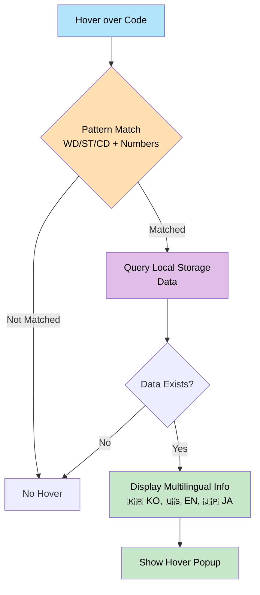
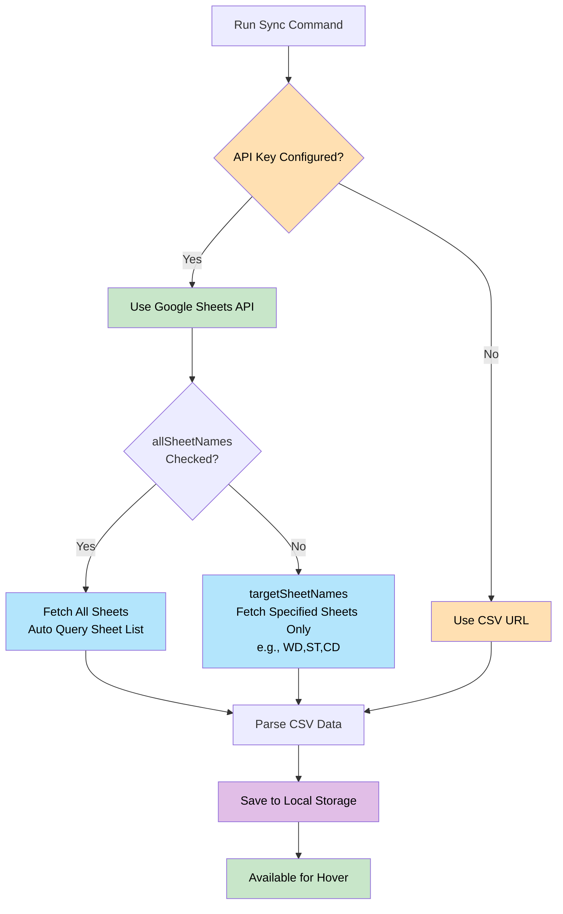
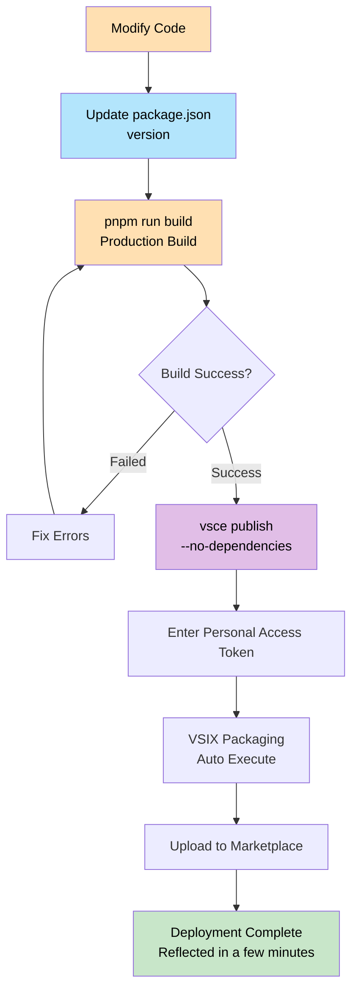

# Sheet Language Global Helper

A VS Code extension that fetches multilingual data from Google Sheets and displays it via hover in your code.

## 🌐 Languages

- [English](README.md) (Current)
- [한국어 (Korean)](README.ko.md)

## 🔗 Links

- 📦 [VS Code Marketplace](https://marketplace.visualstudio.com/items?itemName=language-global-helper.lang-global-helper)
- 💻 [GitHub Repository](https://github.com/jinyDuo/colo-language-extension)

## ✨ Features

- 📊 **Google Sheets Integration**: Fetch multilingual data via Google Sheets API or CSV URL
- 🔍 **Hover Feature**: Hover over keys starting with `WD`, `ST`, `CD` in your code to see multilingual information
- 🏷️ **Inline Translation (Inlay Hints)**: Show translations inline next to keys and translation calls (no hover needed)
- 💾 **Local Caching**: Data is stored in local storage for offline use
- 🔄 **Manual Sync**: Update to the latest data only when needed
- 📝 **Multi-Sheet Support**: Fetch multiple sheets (WD, ST, CD, etc.) at once

### Complete Workflow



## 🚀 Getting Started

### Installation

1. Open VS Code Extensions Marketplace with `Ctrl + Shift + X` (or `Cmd + Shift + X` on Mac)
2. Search for "Sheet Language Global Helper"
3. Click Install

### Configuration

Open VS Code settings with `Ctrl + ,` (or `Cmd + ,` on Mac) and search for "Sheet Language Global Helper".

#### Method 1: Using Google Sheets API (Recommended)

1. **Get API Key**
   - Go to [Google Cloud Console](https://console.cloud.google.com/)
   - Create a project → APIs & Services > Library → Enable "Google Sheets API"
   - APIs & Services > Credentials > Create API Key

2. **Share Sheet Settings** ⚠️ Required
   - Open your Google Spreadsheet and click the **Share** button (top right)
   - Select **Anyone with the link** and set permission to **Viewer**

3. **VS Code Settings**
   - **Sheet Api Key**: Enter your API key
   - **Sheet Id**: Extract ID from spreadsheet URL (or enter full URL for auto-extraction)
   - **All Sheet Names**: Fetch all sheets (default: checked)
   - **Target Sheet Names**: Fetch only specified sheets (e.g., `WD,ST,CD`)

#### Method 2: Using CSV URL

1. In Google Spreadsheet, go to **File > Share > Publish to web** → Select CSV format
2. Enter the generated URL in **Sheet Url**

> 💡 **Priority**: If API key exists, API is used; otherwise, CSV URL is used.

### Configuration Method Comparison



## 📖 Usage

### Data Synchronization

1. Press `Ctrl + Shift + P` → Run "Sheet Language Global Helper: Sheet Connect Sync"
2. Confirm the sync completion message

#### Synchronization Process



### View Multilingual Info via Hover

Hover over keys matching the patterns specified in `hoverKeyPatterns` to see multilingual information:

```typescript
const code = "WD000001";  // Shows multilingual info on hover
getLang("ST000001");      // Also detects inside function calls
t("CD000001");            // Supports getLang, t, i18n, translate, etc.
```

**Display Info**: 🇰🇷 KO, 🇺🇸 EN, 🇯🇵 JA

#### Hover Example


*Example: Hovering over `WD000527` displays multilingual translations (EN: Client, KO: 클라이언트)*

#### How Hover Works



### Show Inline Translation (Inlay Hints)

After running sync, translations can be displayed inline (without hover) as inlay hints:

```typescript
t("WD000001");         // → Hello (based on inlineTranslationLanguage)
t("프로그램 등록");      // → Program Registration (if your sheet key is the Korean text)
```

#### Inlay Hints Example


> Note: Inlay hints are refreshed automatically after sync and when related settings change.

## ⚙️ Configuration

| Setting | Description | Required | Default |
|---------|-------------|----------|---------|
| `sheetApiKey` | Google Sheets API Key | When using API | - |
| `sheetId` | Spreadsheet ID | Optional | - |
| `allSheetNames` | Fetch all sheets | Optional | `true` |
| `targetSheetNames` | Target sheet list (comma-separated) | Optional | `WD,ST,CD` |
| `hoverKeyPatterns` | Hover/Hint key patterns (comma-separated). Used to detect codes like `WD123`, `ST123`. | Optional | `WD,ST,CD` |
| `showInlineTranslation` | Show inline translation as inlay hints | Optional | `true` |
| `inlineTranslationLanguage` | Language to display for inline translation (dropdown: `ko`, `en`, `ja`, etc.) | Optional | `ko` |
| `sheetUrl` | CSV URL | When using CSV | - |

### How It Works



**Summary**:
- **API Key Available**: Use Google Sheets API
  - `allSheetNames` checked → Fetch all sheets
  - `allSheetNames` unchecked → Fetch only sheets specified in `targetSheetNames`
- **No API Key**: Use CSV URL (single sheet only)

## 📝 Spreadsheet Format

| key | ko | en | ja |
|-----|----|----|----|
| WD000001 | 안녕하세요 | Hello | こんにちは |
| ST000001 | 감사합니다 | Thank you | ありがとう |

- First row is used as header
- `key` column is required; `ko`, `en`, `ja` are optional

## 🐛 Troubleshooting

### "API Key is Invalid"
- Verify Google Sheets API is enabled
- Check if the sheet is shared with "Anyone with the link"

### "Sheet ID is Incorrect"
- Verify the ID is correctly extracted from the spreadsheet URL

### Hover Not Working
- Make sure data synchronization has been run first
- Verify you're using keys starting with `WD`, `ST`, `CD` in your code

## 🛠️ Development

### Requirements

- **Node.js 20.x or higher** (Required)
- pnpm (or npm)

### Installation and Build

```bash
# Install dependencies
pnpm install

# Development mode (watch)
pnpm run watch

# Production build
pnpm run build
```

### Testing

1. Press `F5` to run Extension Development Host
2. Create a test file in the new window
3. Hover over codes like `WD000001` to verify

## 📦 Deployment

### Prerequisites

1. Create account/organization on [Azure DevOps](https://dev.azure.com/)
2. Generate Personal Access Token (Marketplace > Manage permission required)

### Deployment Process



### Deployment Commands

```bash
# 1. Install vsce
pnpm add -g @vscode/vsce

# 2. Build
pnpm run build

# 3. Package VSIX
pnpm run package:vsix

# 4. Deploy (skip dependency check)
vsce publish --no-dependencies -p <YOUR_PERSONAL_ACCESS_TOKEN>
```

### Update Deployment

⚠️ **Important**: You must increment the `version` in `package.json` before redeploying after code changes.

```bash
# 1. Update version in package.json (e.g., 0.0.1 → 0.0.2)
# 2. Build and deploy
pnpm run build
vsce publish --no-dependencies -p <TOKEN>
```

### Apply Icon

1. Add `icon.png` to root folder (128x128 recommended)
2. Add `"icon": "icon.png"` to `package.json`
3. Update version and redeploy

## 📄 License

MIT

## 🤝 Contributing

Issues and pull requests are welcome!

---

**Made with ❤️ for better multilingual development experience**
