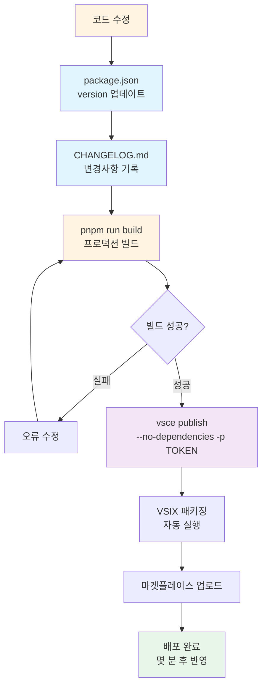
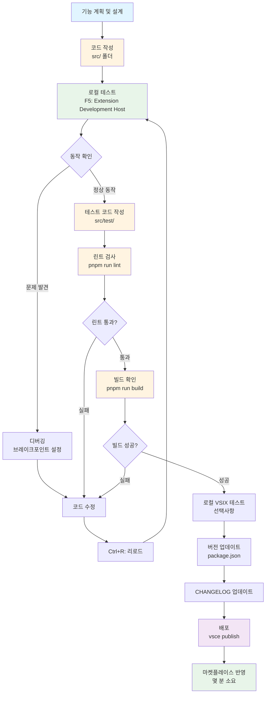
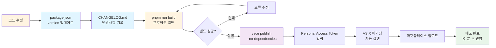
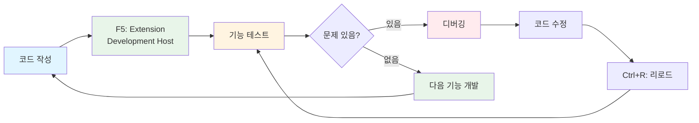
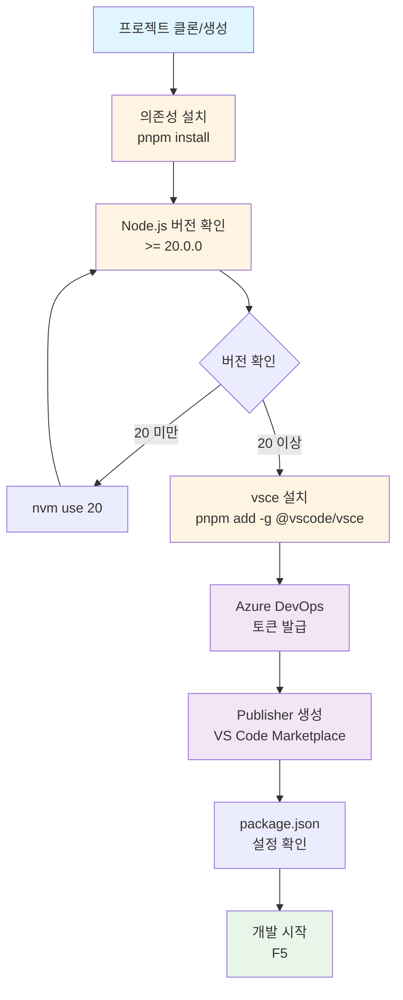

# VS Code Extension 개발 및 배포 가이드

이 문서는 VS Code 익스텐션을 처음부터 개발하고 마켓플레이스에 배포하는 전체 과정을 안내합니다.

## 📋 목차

1. [사전 준비](#사전-준비)
2. [개발 환경 설정](#개발-환경-설정)
3. [개발 시작하기](#개발-시작하기)
4. [코드 작성 및 테스트](#코드-작성-및-테스트)
5. [빌드 및 패키징](#빌드-및-패키징)
6. [마켓플레이스 배포](#마켓플레이스-배포)
7. [업데이트 배포](#업데이트-배포)

---

## 1. 사전 준비

### 1.1 필수 요구사항

- **Node.js 20.x 이상** (필수)
- **pnpm** 또는 npm
- **VS Code** 최신 버전
- **Azure DevOps 계정** (마켓플레이스 배포용)

### 1.2 Node.js 버전 확인 및 설정

```bash
# Node.js 버전 확인
node --version

# Node.js 20.x가 아니면 nvm으로 설치 및 전환
nvm install 20
nvm use 20
nvm alias default 20  # 기본 버전 설정
```

### 1.3 Azure DevOps Personal Access Token 발급

마켓플레이스 배포를 위해 Personal Access Token이 필요합니다.

#### 1.3.1 Azure DevOps 계정 및 조직 생성

**⚠️ 문제 해결: 브라우저 계정 충돌**

브라우저에 다른 Microsoft 계정이 로그인되어 있으면 계정이 꼬일 수 있습니다.

**해결 방법 1: 시크릿 창 사용**
1. 크롬이나 엣지에서 **시크릿 창** 열기 (`Ctrl + Shift + N` 또는 `Cmd + Shift + N`)
2. [https://dev.azure.com/](https://dev.azure.com/) 접속
3. 사용할 계정으로 로그인

**해결 방법 2: 직접 조직 생성 페이지로 이동**
1. [https://aex.dev.azure.com/](https://aex.dev.azure.com/) 접속
2. 프로필이 보이고 오른쪽에 **"Create new organization"** 버튼이 보이면 성공
3. 조직 생성 또는 기존 조직 선택

#### 1.3.2 Personal Access Token 생성

1. Azure DevOps 접속 후 우측 상단 프로필 아이콘 클릭 → **Personal access tokens** 선택
2. **+ New Token** 클릭
3. 설정:
   - **Name**: `VS Code Extension Publishing` (원하는 이름)
   - **Organization**: 본인의 조직 선택
   - **Expiration**: 원하는 만료 기간 설정
   - **Scopes**: **Custom defined** 선택
   - **Marketplace** 섹션에서 **Manage** 권한 체크
4. **Create** 클릭
5. ⚠️ **토큰을 안전한 곳에 복사해두세요!** (한 번만 표시됩니다)

#### 1.3.3 Publisher 생성 (최초 1회)

1. [VS Code Marketplace](https://marketplace.visualstudio.com/manage) 접속
2. **Create Publisher** 클릭
3. Publisher ID 입력 (예: `language-global-helper`)
4. 이름, 이메일 등 정보 입력
5. ⚠️ **Publisher ID는 `package.json`의 `publisher` 필드와 일치해야 합니다**

---

## 2. 개발 환경 설정

### 2.1 의존성 설치

```bash
# 의존성 설치
pnpm install

# 또는 npm 사용 시
npm install
```

### 2.2 package.json 필수 필드 확인

배포 전에 다음 필드들이 올바르게 설정되어 있는지 확인하세요:

```json
{
  "name": "your-extension-id",              // 익스텐션 ID
  "displayName": "Your Extension Name",      // 표시 이름
  "version": "0.0.1",                        // 버전 (배포 시마다 증가)
  "publisher": "your-publisher-id",          // Azure DevOps Publisher ID와 일치
  "icon": "icon.png",                        // 아이콘 파일 (128x128 권장)
  "main": "./dist/extension.js",             // 빌드된 엔트리 포인트
  "engines": {
    "vscode": "^1.100.0",                   // 최소 VS Code 버전
    "node": ">=20.0.0"                       // Node.js 버전 요구사항
  },
  "repository": {                            // GitHub 저장소 (선택사항이지만 권장)
    "type": "git",
    "url": "https://github.com/..."
  },
  "license": "MIT",                          // 라이선스
  "scripts": {
    "vscode:prepublish": "pnpm run package", // 배포 전 자동 실행 스크립트
    "build": "webpack --mode production",
    "package:vsix": "vsce package --no-dependencies"
  }
}
```

### 2.3 vsce 설치

```bash
# 전역 설치
pnpm add -g @vscode/vsce

# 또는 npm 사용 시
npm install -g @vscode/vsce
```

### 2.4 추천 익스텐션 설치

VS Code에서 다음 익스텐션을 설치하면 개발에 도움이 됩니다:

- `amodio.tsl-problem-matcher` - TypeScript 문제 매칭
- `ms-vscode.extension-test-runner` - 테스트 실행
- `dbaeumer.vscode-eslint` - ESLint 지원

---

## 3. 개발 시작하기

### 3.1 개발 모드 실행

```bash
# Watch 모드로 개발 (파일 변경 시 자동 빌드)
pnpm run watch
```

### 3.2 Extension Development Host 실행

1. VS Code에서 `F5` 키를 누르거나
2. **Run and Debug** 패널에서 **Run Extension** 선택
3. 새 VS Code 창이 열리며 익스텐션이 로드됩니다

### 3.3 명령어 테스트

1. 새 창에서 `Ctrl+Shift+P` (또는 `Cmd+Shift+P` on Mac)로 명령 팔레트 열기
2. 익스텐션에서 등록한 명령어 이름 입력
3. 명령어 실행하여 동작 확인

### 3.4 디버깅

- `src/extension.ts` 또는 다른 파일에 브레이크포인트 설정
- 디버그 콘솔에서 로그 확인
- 코드 변경 후 Extension Development Host 창에서 `Ctrl+R` (또는 `Cmd+R`)로 리로드

---

## 4. 코드 작성 및 테스트

### 4.1 테스트 작성

테스트 파일은 `src/test/` 폴더에 `*.test.ts` 패턴으로 작성:

```typescript
import * as assert from 'assert';
import * as vscode from 'vscode';
import { yourFunction } from '../your-module';

suite('Test Suite', () => {
  test('should work correctly', () => {
    // 테스트 로직
  });
});
```

### 4.2 테스트 실행

1. **Extension Test Runner** 익스텐션 설치
2. **Tasks: Run Task** 명령으로 "watch" 태스크 실행
3. Testing 뷰에서 **Run Test** 버튼 클릭 또는 `Ctrl/Cmd + ; A` 단축키
4. 테스트 결과 확인

### 4.3 린트 검사

```bash
# ESLint로 코드 검사
pnpm run lint
```

---

## 5. 빌드 및 패키징

### 5.1 프로덕션 빌드

```bash
# 프로덕션 모드로 빌드
pnpm run build
```

빌드 결과물은 `dist/extension.js`에 생성됩니다.

### 5.2 .vscodeignore 설정

배포 시 불필요한 파일을 제외하려면 `.vscodeignore` 파일을 생성:

```
# .vscodeignore
.pnpm-debug.log
pnpm-lock.yaml
node_modules
src
tsconfig.json
.vscode
**/*.map
test
.idea
```

### 5.3 VSIX 패키징

```bash
# VSIX 파일 생성 (의존성 체크 건너뛰기)
pnpm run package:vsix

# 또는 직접 실행
vsce package --no-dependencies
```

성공 시 `your-extension-0.0.1.vsix` 같은 파일이 생성됩니다.

### 5.4 로컬 설치 테스트

생성된 VSIX 파일을 로컬에서 테스트:

1. VS Code에서 `Ctrl+Shift+X` (또는 `Cmd+Shift+X`)로 익스텐션 뷰 열기
2. `...` 메뉴 → **Install from VSIX...** 선택
3. 생성된 `.vsix` 파일 선택
4. 설치 후 익스텐션 동작 확인

---

## 6. 마켓플레이스 배포

### 6.1 배포 전 체크리스트

- [ ] `package.json`의 `version`이 이전 버전보다 높은지 확인
- [ ] `publisher` 필드가 Azure DevOps Publisher ID와 일치하는지 확인
- [ ] `main` 필드가 올바른 빌드 경로를 가리키는지 확인
- [ ] `vscode:prepublish` 스크립트가 설정되어 있는지 확인
- [ ] `repository` 필드가 설정되어 있는지 확인 (선택사항이지만 권장)
- [ ] `LICENSE` 파일이 있는지 확인
- [ ] 아이콘이 설정되어 있다면 파일이 존재하는지 확인
- [ ] `.vscodeignore` 파일이 올바르게 설정되어 있는지 확인

### 6.2 빌드 및 배포

```bash
# 1. 빌드
pnpm run build

# 2. 마켓플레이스에 배포 (자동으로 패키징 후 배포됨)
vsce publish --no-dependencies -p $VSCE_PAT
```

```bash
# Personal Access Token을 환경변수로 설정 (권장)
export VSCE_PAT="your-personal-access-token"
vsce publish --no-dependencies -p $VSCE_PAT

# 또는 토큰을 직접 입력
vsce publish --no-dependencies
# 프롬프트에서 Personal Access Token 입력
```

### 6.4 배포 확인

배포 성공 시 다음 정보가 표시됩니다:

```
INFO  Extension URL (might take a few minutes): 
  https://marketplace.visualstudio.com/items?itemName=...
INFO  Hub URL: 
  https://marketplace.visualstudio.com/manage/publishers/.../hub
DONE  Published ... v0.0.6.
```

몇 분 후 마켓플레이스에서 익스텐션을 확인할 수 있습니다.

---

## 7. 업데이트 배포

코드를 수정하고 다시 배포할 때는 다음 단계를 따르세요:

### 7.1 버전 업데이트

**⚠️ 중요**: 반드시 `package.json`의 `version`을 올려야 합니다.

```json
{
  "version": "0.0.6"  // → "0.0.7" 또는 "0.1.0" 등으로 증가
}
```

버전 형식: `MAJOR.MINOR.PATCH` (예: `1.2.3`)

### 7.2 CHANGELOG 업데이트

`CHANGELOG.md` 파일에 변경 사항을 기록하세요:

```markdown
## [0.0.7] - 2025-01-XX

### Added
- 새로운 기능 추가

### Fixed
- 버그 수정

### Changed
- 기능 개선
```

### 7.3 배포 프로세스 다이어그램



---

## 8. 문제 해결

### 8.1 빌드 오류

**문제**: `ReferenceError: File is not defined`
- **원인**: Node.js 버전이 20 미만
- **해결**: `nvm use 20`으로 Node.js 버전 전환

**문제**: Webpack 빌드 실패
- **원인**: TypeScript 오류 또는 의존성 문제
- **해결**: `pnpm run lint`로 오류 확인 후 수정

### 8.2 패키징 오류

**문제**: 의존성 체크 오류
- **원인**: `node_modules`에 불필요한 패키지 포함
- **해결**: `--no-dependencies` 플래그 사용

**문제**: 파일 크기 초과
- **원인**: 불필요한 파일이 포함됨
- **해결**: `.vscodeignore` 파일 확인 및 업데이트

### 8.3 배포 오류

**문제**: `Publisher not found`
- **원인**: `package.json`의 `publisher`가 Azure DevOps Publisher ID와 불일치
- **해결**: `package.json`의 `publisher` 필드 확인 및 수정

**문제**: `Invalid Personal Access Token`
- **원인**: 토큰 만료 또는 권한 부족
- **해결**: 
  1. Azure DevOps에서 새 토큰 생성 (Marketplace > Manage 권한 필요)
  2. 브라우저 계정 충돌 시 시크릿 창 사용 (1.3.1 참고)

**문제**: `Version already exists`
- **원인**: 동일한 버전이 이미 배포됨
- **해결**: `package.json`의 `version`을 올려서 재배포

---

## 9. 추가 리소스

### 9.1 공식 문서

- [VS Code Extension API](https://code.visualstudio.com/api)
- [Extension Manifest](https://code.visualstudio.com/api/references/extension-manifest)
- [Publishing Extensions](https://code.visualstudio.com/api/working-with-extensions/publishing-extension)
- [Bundling Extensions](https://code.visualstudio.com/api/working-with-extensions/bundling-extension)

### 9.2 유용한 명령어

```bash
# 개발 모드 (watch)
pnpm run watch

# 프로덕션 빌드
pnpm run build

# 린트 검사
pnpm run lint

# 테스트 실행
pnpm run test

# VSIX 패키징
pnpm run package:vsix

# 마켓플레이스 배포
vsce publish --no-dependencies -p <TOKEN>
```

---

## 10. 개발 워크플로우

### 10.1 전체 개발 프로세스



### 10.2 배포 프로세스 상세



### 10.3 개발 사이클 (반복 작업)



### 10.4 초기 설정 프로세스



---

**Happy Coding! 🚀**
